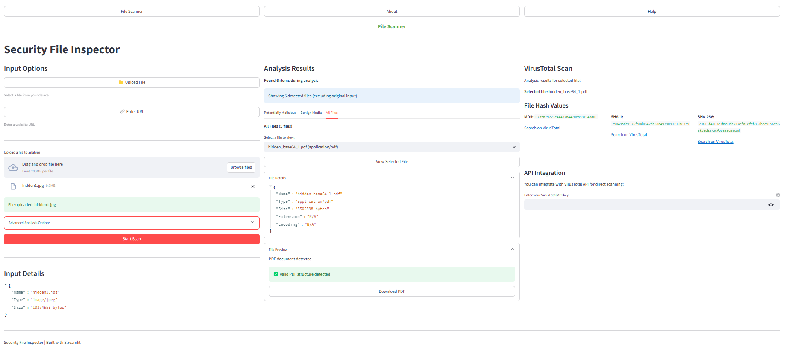

# Security File Inspector

]()

## Overview

Security File Inspector is a Streamlit application designed to analyze and inspect files for security purposes. It offers features such as:

- **File Analysis**: Examine files for potential security threats.
- **Content Extraction**: Extract content from various file types.
- **Virus Scanning**: Scan files using VirusTotal API for malware detection.

## Features

- **File Upload**: Securely upload files for analysis.
- **URL Validation**: Ensure that URLs within files are valid and safe.
- **Content Display**: View extracted content from supported file types.
- **VirusTotal Integration**: Scan files against VirusTotal's database for known threats.

## Installation

To run this app locally:

1. **Clone the Repository**:

   ```bash
   git clone https://github.com/jakk-er/SecurityFileInspector.git
   cd SecurityFileInspector
2. **Set Up a Virtual Environment**:

For Windows:
```
python -m venv myenv
myenv\Scripts\activate
```
For macOS/Linux:
```
python3 -m venv myenv
source myenv/bin/activate
```
Install Dependencies:
```
pip install -r requirements.txt
```
Run the App:
```
streamlit run app.py
```
Access the app at http://localhost:8501.

##Usage

- Upload a File: Use the file uploader to select a file from your system.
- Analyze the File: The app will process the file, extract content, and display relevant information.
- View Results: Check for any security issues, content details, and virus scan results.

##Deployment

The app is deployed on Streamlit Cloud and can be accessed at https://securityfileinspector.streamlit.app/.

##Contributing

We welcome contributions! To contribute:
- Fork the repository.
- Create a new branch (git checkout -b feature-name).
- Commit your changes (git commit -am 'Add new feature').
- Push to the branch (git push origin feature-name).
- Create a new Pull Request.

Please ensure that your code adheres to the project's coding standards and includes appropriate tests.

##License

Distributed under the MIT License. See [LICENSE](LICENSE) for more information.

##Acknowledgements

- Streamlit: For providing an easy-to-use framework for building interactive web apps.
- VirusTotal: For offering a comprehensive malware scanning service.
- Contributors: Thank you to all the contributors who have helped improve this project.

##Author

jakk-er
